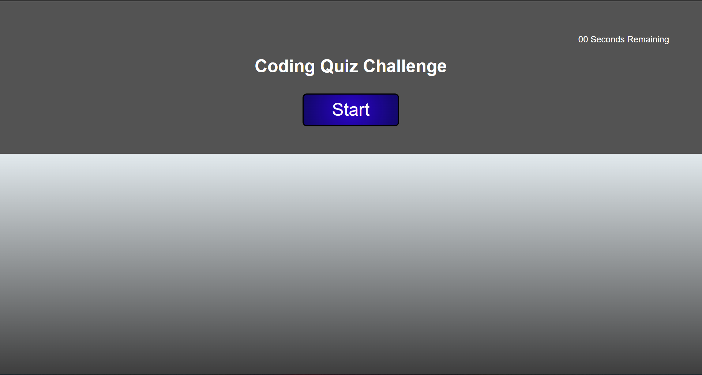

# quiz-app
in this application, i created a multiple choice quiz to test users knowledge of basic coding topics. Style of page changes based on correct and incorrect answers, with incorrect answers also subtracting time from timer. Results page shows score at the end of the quiz.

TODO: debug correct answer on question 3
TODO: add previous scores to results page

deployed: https://jareding87.github.io/quiz-app/
github repo: https://github.com/JaredIng87/quiz-app

